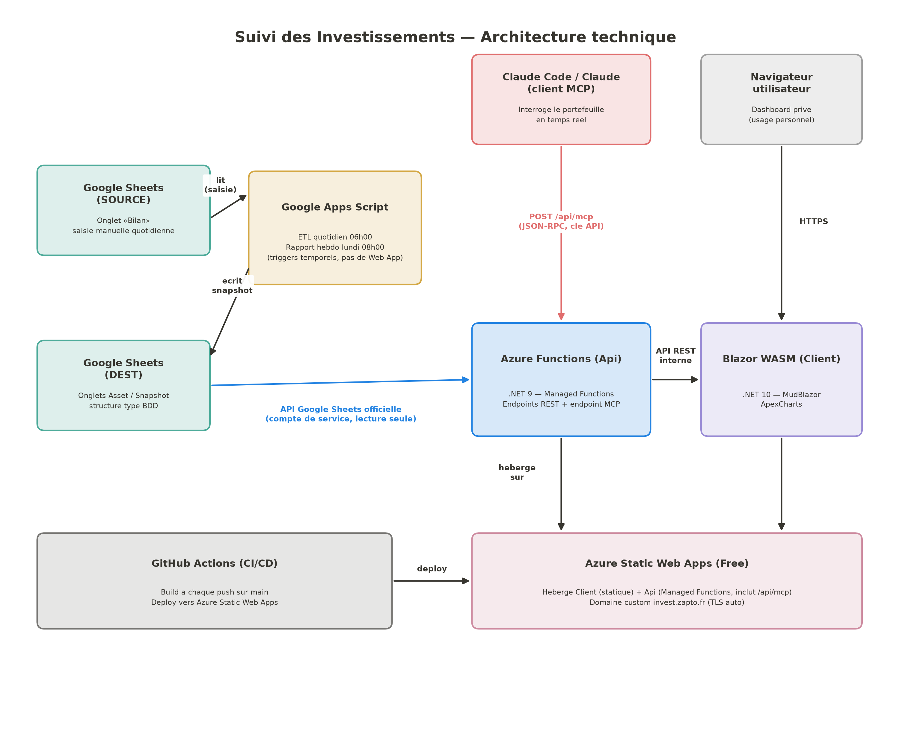

# Suivi des Investissements — Présentation technique

*Dashboard personnel de suivi de portefeuille d'investissement multi-supports.*

---

## 1. Objectif

Visualiser un portefeuille d'investissement multi-supports (actions, obligations, épargne, immobilier, cryptomonnaies, prêts participatifs...) selon deux niveaux de lecture :

- **Vue instantanée** — état du portefeuille au jour le jour : allocations par support, par type d'actif, par actif, par zone géographique.
- **Vue historique** — évolution de ces mêmes indicateurs dans le temps, constituée progressivement par un snapshot quotidien.

Application strictement personnelle et privée, développée avec une contrainte de **budget zéro** (hors nom de domaine déjà possédé) : tous les services utilisés reposent sur leurs tiers gratuits.

---

## 2. Architecture technique



### 2.1 Flux de données

**Alimentation (écriture)**

```
Google Sheets (SOURCE) — saisie manuelle quotidienne, onglet « Bilan »
        │
        ▼  Google Apps Script (ETL, déclenché chaque jour à 06h00)
        │  1. synchronise les colonnes Asset depuis le Bilan
        │  2. calcule et appende une ligne dans l'onglet Snapshot
        ▼
Google Sheets (DEST) — onglets « Asset » et « Snapshot », structurés comme une base de données
```

Un rapport hebdomadaire (email HTML) est envoyé chaque lundi à 08h00, généré par le même Apps Script.

**Lecture (dashboard et intégration IA)**

```
Navigateur (Blazor WASM)  ─── HTTPS ───┐
                                        ▼
Claude Code / Claude (MCP) ─ POST /api/mcp ─▶  Azure Functions (Api, C#)
                                        │
                                        ▼  API Google Sheets officielle (compte de service, lecture seule)
                                        ▼
                          Google Sheets (DEST) — lu directement, sans intermédiaire
```

L'Apps Script n'expose plus de Web App HTTP : il ne fait qu'écrire (ETL + rapport hebdomadaire). L'Api lit le Sheet directement via l'API Google Sheets officielle — pas de cold start, pas d'intermédiaire.

### 2.2 Composants

| Composant | Rôle |
|---|---|
| **Google Sheets** | Source de vérité — deux feuilles : `SOURCE` (saisie manuelle) et `DEST` (structurée type BDD, onglets `Asset`/`Snapshot`) |
| **Google Apps Script** | ETL quotidien (06h00) + rapport hebdomadaire (lundi 08h00) — écriture uniquement, plus jamais appelé depuis l'extérieur |
| **Azure Functions (Api)** | Backend serverless C# — lit le Sheet via un compte de service dédié, expose des endpoints REST + un endpoint MCP pour l'intégration avec les assistants IA (Claude) |
| **Blazor WebAssembly (Client)** | Dashboard — ne détient aucune clé API ni donnée sensible, consomme uniquement les endpoints de l'Api |
| **Azure Static Web Apps** | Hébergement gratuit du Client + de l'Api (Managed Functions), domaine personnalisé `invest.zapto.fr` |
| **GitHub Actions** | CI/CD — build et déploiement automatique à chaque push sur `main` |

### 2.3 Point notable — intégration MCP

L'Api expose un endpoint `POST /api/mcp` (protocole JSON-RPC 2.0, Model Context Protocol) permettant à un assistant IA (Claude Code, Claude Desktop, Claude Web) d'interroger le portefeuille en langage naturel — 8 outils exposés (répartition par classe d'actif, historique de performance, échéancier obligataire, répartition géographique...), avec la même logique métier et les mêmes données que le dashboard.

---

## 3. Stack technique

| Couche | Technologie | Justification |
|---|---|---|
| Données | Google Sheets | Écosystème déjà en place, gratuit |
| ETL | Google Apps Script (triggers temporels) | Gratuit, suffisant pour un traitement quotidien |
| Backend | Azure Functions, .NET 9 (isolated worker) | Serverless, gratuit, lié nativement à Static Web Apps |
| Accès données | `Google.Apis.Sheets.v4` (compte de service, lecture seule) | Lecture directe, rapide, sans cold start |
| Frontend | Blazor WebAssembly, .NET 10 | Langage maîtrisé par le développeur (C# de bout en bout) |
| UI | MudBlazor | Composants riches, bien maintenus |
| Graphiques | ApexCharts for Blazor | Couvre tous les types de visualisation requis |
| Hébergement | Azure Static Web Apps (plan Free) | Gratuit, intégration native des Azure Functions |
| CI/CD | GitHub Actions | Intégration native avec Azure Static Web Apps |
| Tests | xUnit + Moq (Api), xUnit + bUnit (Client) | Couverture systématique des services et composants |

**Architecture applicative** : MVVM côté Client (Views / ViewModels / Model / Shared / Services), architecture en couches côté Api (Functions → Services → Mappers), modèles partagés entre les deux projets.

---

## 4. Sécurité

- **Accès au dashboard** : protégé par un mot de passe unique (`DashboardAuthMiddleware`), vérifié sur toutes les requêtes de l'Api sauf l'endpoint de vérification du mot de passe lui-même et l'endpoint MCP (protégé par sa propre clé). Fail-safe : mot de passe non configuré = accès refusé par défaut.
- **Identifiants Google** (email + clé privée du compte de service) : stockés uniquement dans les App Settings Azure, chiffrés au repos, jamais exposés côté client ni dans le code source.
- **Droits du compte de service** : accès **lecteur uniquement** sur le Google Sheet — il ne peut jamais modifier les données, seul l'Apps Script (compte Google propriétaire) écrit.
- **Endpoints Azure Functions** : liés à Azure Static Web Apps (Managed Functions), non exposés publiquement sur Internet — seul le Client hébergé sur le même Static Web Apps peut les appeler.
- **Session utilisateur** : expiration glissante d'une heure côté navigateur, mot de passe mémorisé dans le `localStorage`.

---

## 5. Coûts

| Service | Plan | Coût mensuel |
|---|---|---|
| Azure Static Web Apps | Free | 0 € |
| Azure Functions | Incluses (Static Web Apps Free) | 0 € |
| Google Sheets API | Gratuit | 0 € |
| Google Apps Script | Gratuit | 0 € |
| GitHub Actions | Gratuit (repo privé) | 0 € |
| Nom de domaine | Déjà possédé | 0 € |
| **Total** | | **0 €/mois** |

---

*Document généré à partir de la documentation technique du projet (CLAUDE.md racine, Api, Client, Scripts).*
